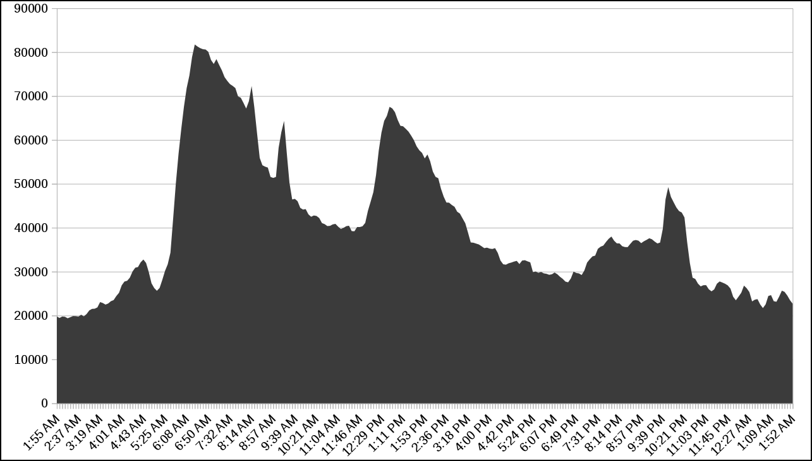
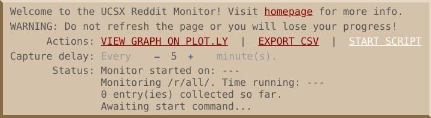

## Note
At the moment script does not support the new reddit design.<br>
I'll implement that as soon as I have some spare time.

**Use the old design for now.** To switch to the old design, prefix the reddit domain in the page URL with subdomain **old** as follows: https://old.reddit.com/r/subreddit

## Table of contents
- [Introduction](#introduction)
- [Installation](#installation)
- [Usage](#usage)
- [Changelog](#changelog)
- [License](#license)

## Introduction
To be successfully getting your posts viral on Reddit, you need to posess something more than just the original and quality content.

That is the knowlege about peak user activity times.
        
This reddit monitor keeps track of the activity of a subreddit of your choice. Collected data can be viewed as a graph on [PLOT.LY](http://plot.ly) or exported in CSV format.

### Example Program Output
Here is a graph of /r/worldnews/ activity for April 12, 2018:



## Installation
First install [Tampermonkey](http://tampermonkey.net/) in your browser.
You can also use other user script managers if you'd like. [Greasemonkey](https://www.greasespot.net/) would do it.

Then intstall the script from:
* [Greasy Fork](https://greasyfork.org/ru/scripts/40775-ucsx-reddit-monitor-graph-followers-activity-of-a-subreddit)
* [OpenUserJS](https://openuserjs.org/scripts/arcan770077f/[UCSX_Reddit_Monitor]_Graph_Followers_Activity_Of_A_Subreddit).
* Or [install now with one click](https://raw.githubusercontent.com/arkadyt/_UCSX_Reddit_Monitor_/master/script.user.js).

## Usage
After you've installed the userscript, visit the subreddit that you would like to monitor. Make sure that your userscript manager is enabled and this script is installed.

You will see a small brown panel down the screen:



Click on the `START SCRIPT` button to launch monitoring.

Once you are done monitoring, click on the `EXPORT CSV` to export data in CSV format or `VIEW GRAPH ON PLOT.LY` to view the graph immediately. 

`**WARNING** do not refresh page or navigate anywhere while this script is running. Doing so will result in data loss.`

You will be prompted with this message if you accidentally navigate out.

### Reference on GUI
Label&nbsp;&nbsp;&nbsp;&nbsp;&nbsp;&nbsp;&nbsp;&nbsp;&nbsp;&nbsp;&nbsp;&nbsp;&nbsp;&nbsp;&nbsp;&nbsp;&nbsp;&nbsp;&nbsp;&nbsp;&nbsp;&nbsp;&nbsp;&nbsp;&nbsp;&nbsp;&nbsp;&nbsp;&nbsp;&nbsp;&nbsp;&nbsp;&nbsp;&nbsp;&nbsp;&nbsp;&nbsp;&nbsp;&nbsp;&nbsp;&nbsp;&nbsp;&nbsp;&nbsp;&nbsp;|Function
 ---------------------- | -------------------------
`VIEW GRAPH ON PLOT.LY` | Clicking this will take you to the [PLOT.LY](https://plot.ly) where you'll be presented with a plot made out of the data that has been collected so far. This won't interrupt monitoring process.
`EXPORT CSV`            | Click this if you need collected data in a CSV sheet. This won't interrupt monitoring process.
`START SCRIPT`          | Starts the monitor. Will be switched to `RESET SCRIPT` once clicked.
`RESET SCRIPT`          | Erases data and restarts the monitor.
`Capture delay`         | Controls data point frequency on the graph. Connection is directly proportional.

## Changelog
	/* Changelog
	 * v1.2.0
	 *   - Now compatible with new Reddit design.
	 *   - Added support for some old browsers.
	 * v1.1.2
	 *   - @supportURL now points at 'Table of contents' section instead of repository issues.
	 *   - Added this changelog.
	 *
	 * v1.1.1
	 *   - Fixed wrong GitHub username in URLs.
	 *   - Updated README.md.
	 *
	 * v1.1.0
	 *   - UI now resides in its own floating panel.
	 *   - Graphs can now be viewed on Plot.ly with one click.
	 *   - Added comprehensive status output.
	 *   - Capture frequency can now be changed.
	 *   - Script now has to be started manually.
	 *   - Added page leave confirmation prompt.
	 *   - CSV date values now include month and date.
	 *   - Various code optimizations.
	 *
	 *   Bugfixes
	 *   - Fixed incorrect entry count display.
	 *   - Fixed #1. Need to double click 'EXPORT CSV' link to export file.
	 *   - Fixed #2. Link underlining is absent at control panel.
	 *   - Fixed #3 & #6. Page refresh resets the script & Page refresh causes frequency counter reset.
	 *   - Fixed #4. Second counter falls into negative values when rapidly changing scan frequency.
	 *   - Fixed #5. XMLHttp requests start getting cached after a period of inactivity.
	 *
	 * v1.0.0
	 *   - Added GUI, 'Export CSV' and 'Restart' buttons in the top subreddit panel.
	 *   - Added CSV export functionality.
	 *   - Improved restarting routine.
	 *   - Took off storage limits.
	 *   - Added display of current amount of collected entries.
	 *
	 *   Known bugs:
	 *   - Have to double click the 'Export CSV' button to see download prompt.
	 *
	 * v0.1
	 *   - Scans subreddit pages
	 *   - Logs unformatted captured data in console
	 *
	 *   Limitations:
	 *   - No GUI
	 *   - Limited in available storage (4093 bytes)
	 *   - Quickly eats up RAM due to frequent page refreshing
	 * */

## License

```
The MIT License (MIT)

Copyright © 2020, Andrew Titenko

Permission is hereby granted, free of charge, to any person obtaining a copy of
this software and associated documentation files (the "Software"), to deal in
the Software without restriction, including without limitation the rights to
use, copy, modify, merge, publish, distribute, sublicense, and/or sell copies of
the Software, and to permit persons to whom the Software is furnished to do so,
subject to the following conditions:

The above copyright notice and this permission notice shall be included in all
copies or substantial portions of the Software.

THE SOFTWARE IS PROVIDED "AS IS", WITHOUT WARRANTY OF ANY KIND, EXPRESS OR
IMPLIED, INCLUDING BUT NOT LIMITED TO THE WARRANTIES OF MERCHANTABILITY, FITNESS
FOR A PARTICULAR PURPOSE AND NONINFRINGEMENT. IN NO EVENT SHALL THE AUTHORS OR
COPYRIGHT HOLDERS BE LIABLE FOR ANY CLAIM, DAMAGES OR OTHER LIABILITY, WHETHER
IN AN ACTION OF CONTRACT, TORT OR OTHERWISE, ARISING FROM, OUT OF OR IN
CONNECTION WITH THE SOFTWARE OR THE USE OR OTHER DEALINGS IN THE SOFTWARE.
```
